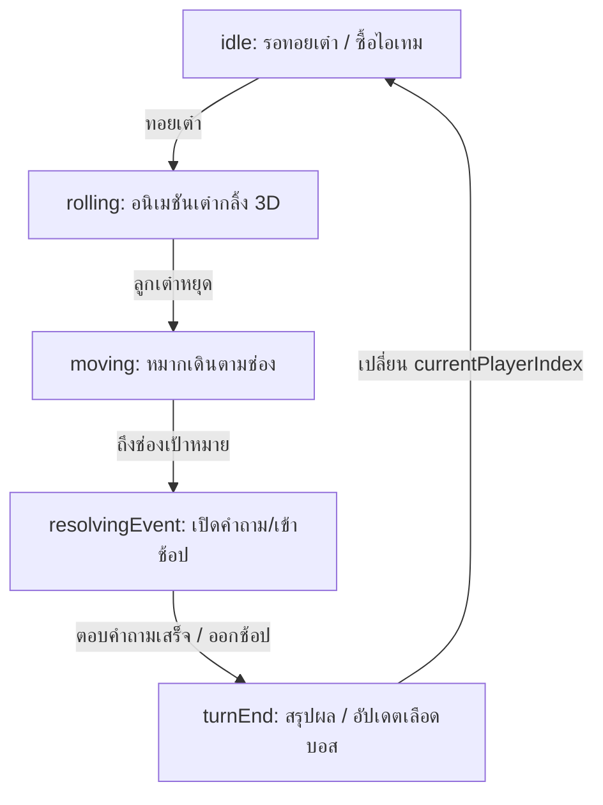

# 🚀 SCAMBOARD — Master Documentation (Ultimate Season Archive)

เอกสารฉบับนี้คือ **คัมภีร์หลัก (Master Bible)** ของโปรเจกต์ ScamBoard ที่เจาะลึกถึงระดับสถาปัตยกรรม (Architecture), Data Flow, สคีมา (Schema), และ State Machine ทั้งหมดของเกม เพื่อให้ Developer สามารถสานต่อโปรเจกต์ได้ 100% โดยไม่มีข้อสงสัย

---

## 📌 1. Project Overview (ภาพรวมและแก่นของเกม)
**ScamBoard** เป็นเกมกระดานออนไลน์แบบ Multiplayer 3D สไตล์ AAA Premium Cyberpunk ที่สร้างขึ้นเพื่อให้ความรู้ด้านความปลอดภัยทางไซเบอร์ (Cybersecurity) 

ผู้เล่นเผชิญหน้ากับ **Scammer AI Boss** โดยใช้ความรู้ด้านไซเบอร์ในการหลบหลีก Phishing, แก๊งคอลเซ็นเตอร์, และมัลแวร์ ระบบถูกออกแบบให้กดดันผู้เล่นผ่าน **Threat Level** ที่เพิ่มสูงขึ้นทุกเทิร์น 

---

## 🏗️ 2. System Architecture & State Machine

เกมนี้ใช้สถาปัตยกรรมแบบ **Centralized State Monolith** ภายใน React Component (`ScamBoardGame.tsx`) โดยมี Socket.IO ทำหน้าที่เป็น "State Mirror" สะท้อนข้อมูลไปยัง Client อื่นๆ

### 2.1 State Management (ตัวแปร `s`)
สถานะทั้งหมดของเกมถูกห่อหุ้มในตัวแปรเดียวเพื่อให้ง่ายต่อการ Sync ผ่าน Socket:

```typescript
{
  view: 'menu' | 'setup' | 'playing' | 'finished' | 'gameover_boss', // หน้าจอที่แอคทีฟอยู่
  mode: 'race' | 'score', // โหมดการเล่น (เข้าเส้นชัยก่อน vs เหรียญเยอะสุด)
  players: Player[], // Array ของผู้เล่นทั้งหมดในเกม
  currentPlayerIndex: 0, // ตำแหน่ง Index ว่าถึงตาใคร (0-3)
  board: Tile[], // Array 40 ช่องของกระดานเกม
  usedCyber: number[], // ID คำถามไซเบอร์ที่ออกไปแล้ว (กันซ้ำ)
  usedBonus: number[], // ID คำถามโบนัสที่ออกไปแล้ว (กันซ้ำ)
  turnPhase: 'idle' | 'rolling' | 'moving' | 'resolvingEvent' | 'turnEnd', // State Machine ของเทิร์น
  diceValue: 1, // ค่าลูกเต๋าล่าสุด
  activeEvent: any, // เก็บ Event ปัจจุบัน เช่น คำถามหรือร้านค้า
  bossHealth: 0, // หลอดเลือดบอส (0 ถึง 100)
  roundCount: 1, // นับจำนวนรอบที่เล่นจบไปแล้ว (ใช้คำนวณ Threat Level)
}
```

### 2.2 Turn Flow Diagram (วงจรการเล่น)
การทำงานของแต่ละเทิร์นถูกควบคุมด้วย `turnPhase`:



---

## 🗄️ 3. Data Schemas (โครงสร้างข้อมูล)

ข้อมูลใน `src/gameData.ts` ถูกออกแบบให้แก้ไขง่ายโดยไม่ต้องแก้ Logic:

### 3.1 Cyber Card (คำถามหลัก)
```typescript
interface CyberCard {
  id: number;
  title: string;
  situation: string; // เหตุการณ์การหลอกลวง
  optionA: string;
  optionB: string;
  correct: 'A' | 'B'; // คำตอบที่ถูก
  resultCorrect: number; // เงินที่ได้ (+2)
  resultWrong: number; // เงินที่เสีย (-2)
  explanation: string; // คำอธิบายสอนผู้เล่น
}
```

### 3.2 Shop Item (ไอเทมตลาดมืด)
ระบบถูกออกแบบให้เพิ่มไอเทมใหม่ได้ง่าย เพียงเพิ่มลงใน Array และไปดัก `if(itemId)` ในฟังก์ชัน `activateItem`
```typescript
interface ShopItem {
  id: string; // 'firewall', 'ddos', 'datasteal', 'swap', 'pass_buck'
  name: string;
  cost: number;
  description: string;
  icon: string; // อ้างอิงถึง Lucide Icon
}
```

---

## ⚔️ 4. Mechanics Deep Dive (เจาะลึกกลไก)

### 4.1 Threat Level Scaling (สเกลความยากของบอส)
- บอสเริ่มต้นที่เลือด `0` ไปสิ้นสุดที่ `100` (Mainframe Destroyed = Game Over)
- **เมื่อตอบถูก:** บอสเลือดลด `5` แต้ม (โจมตีสวนกลับ)
- **เมื่อตอบผิด:** ความเสียหายพื้นฐานคือ `15` แต้ม
- **การคูณดาเมจ (Threat Lvl):** ในฟังก์ชัน `endTurn` เมื่อวนครบ 1 รอบ `roundCount` จะบวก 1 
- สูตรดาเมจ: `15 * (1 + (roundCount * 0.2))` หมายความว่า ดาเมจบอสจะแรงขึ้น 20% ทุกๆ รอบ (Round 1: 15 / Round 2: 18 / Round 3: 21)

### 4.2 LocalStorage Persistence (ระบบบันทึกป้ายรางวัล)
การแจก Badge อาศัย `consecutive` (ตอบถูกติดกัน):
- เมื่อ `consecutive === 3` ผู้เล่นจะได้ Badge `CYBER GUARDIAN`
- ระบบจะเช็คและเขียนลง `localStorage.setItem('scamboard_badges', ...)`
- เมื่อสร้างห้องใหม่ (หน้า Setup) เกมจะอ่าน `localStorage.getItem('scamboard_badges')` มาใส่เป็นค่าเริ่มต้นให้ผู้เล่นทันที

---

## 🎨 5. UI/UX Pro Max Implementation Details

### 5.1 CSS & Tailwind v4 Hacks
เนื่องจาก Tailwind v4 เลิกใช้ `@apply` ในบางบริบท (ทำให้ Vercel พังในตอนแรก) เราจึงเขียน Standard CSS แทรกใน `index.css` เพื่อความเสถียร 100%:

- **Glitch Effect:** ใช้ `@keyframes sb-glitch` สลับค่า `transform` ซ้ายขวาอย่างรวดเร็ว
- **Scanlines:** สร้างเส้นสแกนทีวีด้วย `linear-gradient` วางทับเป็น `pointer-events-none`
- **Neon Glows:** ใช้ `drop-shadow-[0_0_10px_#HEX]` ซ้อนกัน แทนการใช้ box-shadow ธรรมดา เพื่อให้ขอบเบลอสวยงามเข้ากับกระจก (Glassmorphism)
- **Glass Panel:** `bg-black/60 backdrop-blur-xl border border-white/10` 

### 5.2 3D Board Rendering (Three.js)
ใน `GameBoard3D.tsx`:
- ใช้ `GridHelper` สีม่วงแดง `#FF007F` สำหรับสร้างพื้น Cyberpunk Matrix
- ตัวหมาก (`mesh` กระบอก) เปลี่ยนสีตาม `p.color` โดยดึงสีออกมาเป็น Hex ด้วยฟังก์ชัน `getColorHex(colorClass)`
- กล้อง Camera จะเคลื่อนที่ตามผู้เล่นที่กำลังเดิน (Lerp) ด้วย `useFrame`

---

## 🌐 6. Socket.IO Multiplayer Architecture

### 6.1 Sync Flow (การซิงก์ข้อมูล)
1. **Host:** สร้างห้อง (ได้ Room Code) และเก็บ State ตัวแม่ไว้ที่เครื่องตัวเอง
2. **Client:** กรอก Room Code เพื่อ Join -> รันฟังก์ชัน `socket.emit('join_room', code)`
3. **Host-to-Client Update:** เมื่อ Host มีการทอยเต๋า หรือตอบคำถาม `updateS(newState)` จะทำงาน -> ยิง `socket.emit('state_update', newState)` ไปที่ Server
4. **Server:** บรอดแคสต์ newState ไปให้ Client คนอื่นในห้องเดียวกัน
5. **Client-to-Host Action:** เมื่อ Client กดทอยเต๋า หรือตอบคำถาม จะส่ง Event พิเศษ (เช่น `player_roll`, `player_answer`) ไปให้ Host ทำการคำนวณ State แล้วบรอดแคสต์กลับมา (เพื่อป้องกัน Data Conflict)

---

## 🚀 7. Troubleshooting & Vercel/Render Tips

- **ปัญหา "Server URL ไม่ถูก":** หน้า UI จะค้างตอนกด Create Room ตรวจสอบว่าไฟล์ `.env.production` มี `VITE_SERVER_URL=https://scamboard.onrender.com` หรือไม่
- **ปัญหา "Render หลับ (Spin Down)":** ในแพ็กเกจฟรีของ Render หากไม่มีทราฟฟิก 15 นาที เซิร์ฟเวอร์จะดับชั่วคราว การ Join ห้องครั้งแรกอาจใช้เวลา 50 วินาทีในการปลุก (Wake up) ให้รอซักพัก
- **ปัญหา TypeScript unused variables:** Vercel รัน TSC เสมอก่อน Build ห้ามมีการประกาศตัวแปรแล้วไม่ใช้เด็ดขาด (เช่น ลืมลบ `lookAtTarget` หรือ `useState` ที่ไม่ได้ใช้) ไม่งั้น Build พังทันที

---

## 🎯 8. Future Roadmap: The Next Season (สิ่งที่ต้องทำต่อไป)

หากนำโปรเจกต์นี้ไปทำต่อ นี่คือ Checklist ระดับโปรเจกต์ใหญ่:

1. **Database Migration (Supabase / PostgreSQL):**
   - เปลี่ยนจากเล่นแบบ Socket-memory ไปเก็บ State และ User Profiles ใน DB เพื่อให้เกิดระบบ Leaderboard ระดับโลก
2. **Authentication (Clerk / NextAuth):**
   - ล็อกอินด้วยบัญชี Google เพื่อผูก Badge ไว้กับ Account ตัวเองแทนการเก็บในเครื่อง (LocalStorage)
3. **New Event Tiles (ช่องพิเศษ):**
   - **Gacha Node:** สุ่มไอเทม
   - **Dark Web Node:** ขโมยเงินคนอื่น
4. **Sound Manager / BGM Control:**
   - ตอนนี้ Web Audio API สังเคราะห์เสียง 8-bit ควรเปลี่ยนไปโหลดไฟล์ `.mp3` / `.wav` แท้ด้วย `Howler.js` เพื่อให้เสียงอลังการแบบ AAA ขึ้น
5. **Animation Polish:**
   - ใช้ `@react-spring/three` เพื่อทำให้การกระโดดข้ามช่อง 3D ของหมากลื่นไหลแบบโค้ง Parabola (ตอนนี้น้องเดินไถลไปดื้อๆ)

---
*Generated by Antigravity AI - System Master Archive*
*Last Updated: 27 July 2026*
